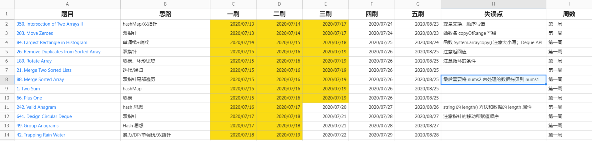
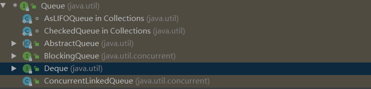
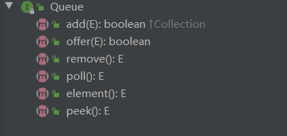
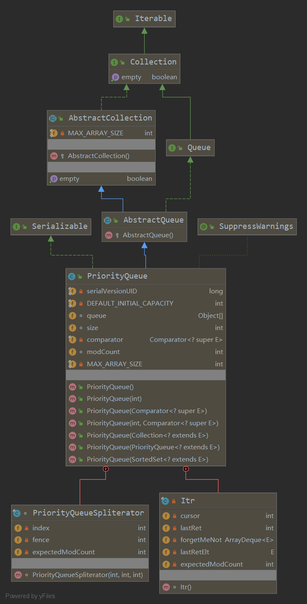

# Week 1 学习总结

## LeetCode 练习



[Excel 源文件](../leetcode刷题2020.xlsx)

## Deque 练习

用 add first 或 add last 这套新的 API 改写 Deque 的代码。

```java
public static void main(String[] args) {
    Deque<String> deque = new ArrayDeque<>();

    deque.addLast("a");
    deque.addLast("b");
    deque.addLast("c");
    System.out.println(deque);

    String str = deque.peekFirst();
    System.out.println(str);
    System.out.println(deque);

    while (deque.size() > 0) {
        System.out.println(deque.removeFirst());
    }

    System.out.println(deque);

}
```

## Queue 源码分析

Queue 是一个接口，其子类主要有：




在 Queue 中定义了队列的基本操作：



* `remove` 方法，如果队列为空，会抛出异常。`poll` 和 `peek`  方法会返回 `null`。
* 当队列已满时，`add` 方法会抛出 `IllegalStateException` 异常，`offer`  方法会直接抛出 `Exception`

## PriorityQueue 源码分析



### 主要属性
```java
// 默认初始化容量
private static final int DEFAULT_INITIAL_CAPACITY = 11;

// 存放数据，维护了一个平衡二叉堆实现。堆顶是最小的元素。
// 根节点的索引为 0
// 对于索引为 n 的元素，其左子节点是 2n + 1， 右子节点是 2n + 2 
// 对于索引为 k 的元素，其父节点为 (k - 1)/2 
transient Object[] queue; // non-private to simplify nested class access

// 队列当前元素个数
int size;

// 比较器，用于比较元素大小，如果没有指定，按照元素自然排序
private final Comparator<? super E> comparator;

// 记录修改次数
transient int modCount; // non-private to simplify nested class access

```

> 关于 non-private to simplify nested class access 可参考: [为什么默认访问权限可以简化嵌套类访问过程](https://twodam.net/why-non-private-can-simlify-nested-class-access)


### 主要方法

#### 添加元素：offer()

```java
public boolean offer(E e) {
    // 添加元素，如果元素为重，则抛出异常
    if (e == null)
        throw new NullPointerException();
    modCount++;
    // 如果队列已满，则扩容，如果当前队列小于 64 , 则扩容为原来的 2 倍，否则扩容 50%
    int i = size;
    if (i >= queue.length)
        grow(i + 1);
    // 先将元素插入堆最后，然后从下往上调整堆
    siftUp(i, e);
    size = i + 1;
    return true;
}
```


```java
// 在索引 k 处插入一个元素，自低向上调整堆
private void siftUp(int k, E x) {
    if (comparator != null)
        siftUpUsingComparator(k, x, queue, comparator);
    else
        siftUpComparable(k, x, queue);
}

// 维持堆的不变性，从下调往上整元素位置，直到当前元素小于其父元素，满足最小堆的条件
private static <T> void siftUpComparable(int k, T x, Object[] es) {
    Comparable<? super T> key = (Comparable<? super T>) x;
    while (k > 0) {
        int parent = (k - 1) >>> 1;
        Object e = es[parent];
        if (key.compareTo((T) e) >= 0)
            break;
        es[k] = e;
        k = parent;
    }
    es[k] = key;
}
```

#### 删除元素：remove()

```java
public boolean remove(Object o) {
    // 查找是逐个遍历查找，复杂度为 O(n)
    int i = indexOf(o);
    if (i == -1)
        return false;
    else {
        removeAt(i);
        return true;
    }
}
```

```java
E removeAt(int i) {
    // assert i >= 0 && i < size;
    final Object[] es = queue;
    modCount++;
    int s = --size;
    if (s == i) // removed last element
        es[i] = null;
    else {
        // 取堆最后一个元素
        E moved = (E) es[s];
        es[s] = null;
        // 将最后一个元素换到 i 位置，再由上往下调整堆
        siftDown(i, moved);
        // 当插入的节点比其左右子节点大，这个时候会出现向下调整，由于插入节点比当前节点大，所以无需再进行向上调整操作
        // 当插入的节点比其左节点或右节点小，或者为叶子节点是，是无需向下调整的，此时 es[i] == moved
        if (es[i] == moved) {
            siftUp(i, moved);
            // 如果通过 siftUp 操作调整了元素位置，返回被移动的元素
            if (es[i] != moved)
                return moved;
        }
    }
    return null;
}
```

```java
// 在索引 k 处插入一个元素，自顶向下调整堆, 并不能保证堆的不变性
private void siftDown(int k, E x) {
    if (comparator != null)
        siftDownUsingComparator(k, x, queue, size, comparator);
    else
        siftDownComparable(k, x, queue, size);
}

// n 为队列元素个数
private static <T> void siftDownComparable(int k, T x, Object[] es, int n) {
    // assert n > 0;
    Comparable<? super T> key = (Comparable<? super T>)x;
    // 由于堆是一个完全二叉树，所以其所有的叶子节点索引都 >= n/2 
    int half = n >>> 1;           // loop while a non-leaf
    // 如果插入的位置为非叶子节点
    while (k < half) {
        int child = (k << 1) + 1; // assume left child is least
        Object c = es[child];
        int right = child + 1;
        // 如果元素的右节点存在，并且左节点大于右节点，则选取右节点交换
        if (right < n &&
            ((Comparable<? super T>) c).compareTo((T) es[right]) > 0)
            c = es[child = right];
        // 如果插入元素小于左节点元素，则无需交换（前面已经保证了左节点小于右节点）
        if (key.compareTo((T) c) <= 0)
            break;
        es[k] = c;
        k = child;
    }
    // 如果插入的位置为叶子节点，则直接插入，
    // 注意这个时候最小堆的性质没有得到保证，还需要通过 siftUp 调整
    es[k] = key;
}
```

#### 建堆 ：heapify()

```java
// 建堆复杂度 O(n)
private void heapify() {
    final Object[] es = queue;
    // 因为叶子节点往下堆化，只能和自己比较，所以从非叶子节点开始堆化
    int n = size, i = (n >>> 1) - 1;
    final Comparator<? super E> cmp;
    if ((cmp = comparator) == null)
        for (; i >= 0; i--)
            siftDownComparable(i, (E) es[i], es, n);
    else
        for (; i >= 0; i--)
            siftDownUsingComparator(i, (E) es[i], es, n, cmp);
}
```