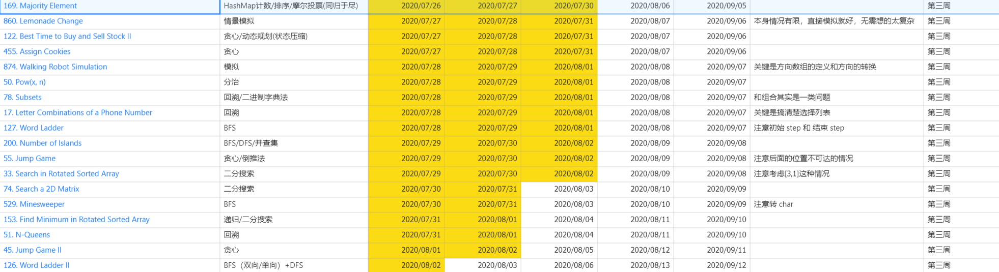

# Week3 学习总结

## LeetCode 练习



[Excel 源文件](../leetcode刷题2020.xlsx)


## 总结

题目：使用二分查找，寻找一个半有序数组 [4, 5, 6, 7, 0, 1, 2] 中间无序的地方。同学们可以将自己的思路、代码写在学习总结中。

分析：假设有序和无序部分的分界点索引为 p ，则 nums[p] 一定是数组中最小的元素。

```java
public class Solution {

   public int search(int[] nums) {
      int l = 0, r = nums.length - 1;
      while (l <= r) {
          int mid = l + (r - l + 1) / 2;
          // 发生了逆序
          if (nums[mid] <= nums[0] && nums[mid] <= nums[mid - 1]) {
              return mid;
          }
          // 如果在 0  ->  mid, 中 nums[mid] 不是最小的，说明分界点靠右
          if (nums[mid] > nums[0]) {
              // 分界点靠右
              l = mid + 1;
          } else {
              r = mid - 1;
          }
      }
      return l;
   }

   @Test
    public void test() {
       TestCase.assertEquals(4, search(new int[] {4, 5, 6, 7, 0, 1, 2}));
       TestCase.assertEquals(2, search(new int[] {4, 5, 1}));
       TestCase.assertEquals(2, search(new int[] {4, 5, 6}));
       // 完全逆序，这种情况处理不了
//       TestCase.assertEquals(0, search(new int[] {6, 5, 4}));
   }
}
```


