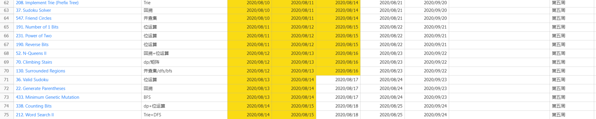

# Week5 学习总结

## LeetCode 练习



[Excel 源文件](../leetcode刷题2020.xlsx)

# WordSearchII 复杂度分析

```java
/**
 * @author BeauFang
 * Date: 2020/8/15
 * 212 https://leetcode-cn.com/problems/word-search-ii/
 */
public class WordSearchII_2 {

    private final int[][] D = {{0, 1}, {1, 0}, {0, -1}, {-1, 0}};
    private char[][] board;

    public List<String> findWords(char[][] board, String[] words) {
        Trie trie = new Trie();
        this.board = board;
        for (String word : words) {
            trie.insert(word);
        }
        List<String> res = new ArrayList<>();
        int m = board.length;
        int n = board[0].length;
        for (int i = 0; i < m; i++) {
            for (int j = 0; j < n; j++) {
                dfs(i, j, res, trie);
            }
        }
        return res;
    }


    private void dfs(int i, int j,  List<String> res, Trie trie) {
        char origin = board[i][j];
        trie = trie.next[origin - 'a'];
        if (trie == null) return;
        if (trie.word != null) {
            res.add(trie.word);
            // 将该节点的单词置空，防止结果重复
            trie.word = null;
        }
        board[i][j] = '@';
        for (int[] d : D) {
            int newI = i + d[0];
            int newJ = j + d[1];
            if (newI >= 0 && newI < board.length && newJ >= 0 && newJ < board[0].length && board[newI][newJ] != '@') {
                dfs(newI, newJ, res, trie);
            }
        }
        board[i][j] = origin;
    }

    static class Trie {

        private final Trie[] next;
        private String word;

        public Trie() {
            next = new Trie[26];
        }

        public void insert(String word) {
            if (word == null || word.length() == 0) {
                return;
            }
            Trie curr = this;
            char[] chs = word.toCharArray();
            for (char c : chs) {
                int n = c - 'a';
                if (curr.next[n] == null) {
                    curr.next[n] = new Trie();
                }
                curr = curr.next[n];
            }
            curr.word = word;

        }
    }
}

```

假设 borad 中字母的个数为 M 个，每个字母都需要进行一次上下左右四个方向的扩展，在第二次扩展的时候，除掉原方向，需要扩展三个方向。假设单词的长度为 L，则最坏情形下的复杂度为 `O(m * 4 * 3^(L-1))`

# 双向BFS 模板

双向 BFS 中，使用的 Queue 要改为 Set，方便快速判断两个集合是否右交集。每次从较小的一段开始遍历。通常在知道终点的情况下使用。

```java
public int binBfs(Node start, Node target) {
    if (start == target) return 0;
    Set<Node> q1 = new HashSet<>();
    Set<Node> q2 = new HashSet<>();
    Set<Node> visited = new HashSet<>();
    q1.add(start);
    q2.add(target);
    visited.add(start);
    visited.add(target);
    int step = 0;
    while (!q1.isEmpty() && !q2.isEmpty()) {
        // 总是从较小的一端处理
        if (q1.size() > q2.size()) {
            Set<Node> tmp = q1;
            q1 = q2;
            q2 = tmp;
        }
        // 用于存储下一层的节点
        Set<Node> nextLevel = new HashSet<>();
        for (Node cur : q1) {

            if (cur.children == null) {
                continue;
            }
            for (Node child : cur.children) {
                if (q2.contains(child)) {
                    return  step + 1;
                }
                if (!visited.contains(child)) {
                    nextLevel.add(child);
                }
            }
        }
        step++;
        // 注意是直接覆盖
        q1 = nextLevel;
        visited.addAll(nextLevel);
    }
    return -1;
}
```

