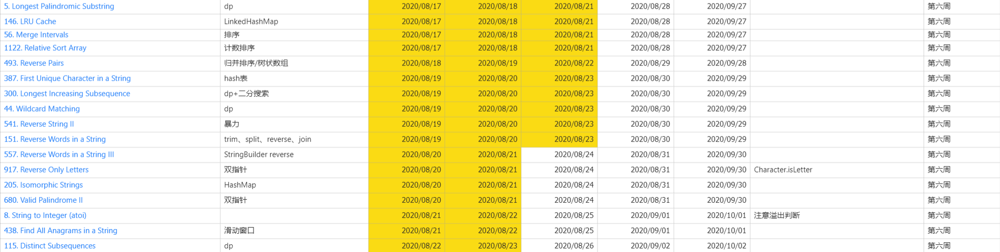

# Week6 学习总结

## LeetCode 练习



[Excel 源文件](../leetcode刷题2020.xlsx)

# 

# 冒泡排序（Bubble Sort）

**冒泡排序(Bubble Sort)**：双重循环比大小，前者大了做交换，一轮循环走下来，大的冒到最后面。

```Java
public void bubbleSort(int[] arr) {
    int len = arr.length;
    if (len <= 1) return;
    for (int i = 0; i < len; i++) {
        // 提前退出冒泡循环的标志位, false 表示没有数组交换
        boolean flag = false;
        for (int j = 0; j < len - 1; j++) {
            // 大了做交换
            if (arr[j] > arr[j + 1]) {
                int temp = arr[j];
                arr[j] = arr[j + 1];
                arr[j + 1] = temp;
                flag = true;
            }
        }
        // 这一趟比较下来，没有数据交换，就退出
        if(!flag) break;
    }
}
```

# 选择排序（Selection Sort）

**选择排序（Selection Sort）**：数组分为两部分，前面有序后无序，无序里面选最小，放在有序最后面，直到无序被取完，整个数组变有序。

```Java
public void selectionSort(int[] arr) {
    int len = arr.length;
    if (len <= 1) return;
    for (int i = 0; i < len - 1; i++) {
        int minIndex = i;
        // 找出待排序区间中最小的元素
        for (int j = i + 1; j < len; j++) {
            if (arr[j] < arr[minIndex]) {
                minIndex = j;
            }
        }
        int temp = arr[i];
        arr[i] = arr[minIndex];
        arr[minIndex] = temp;
    }
}
```

# 插入排序（Insertion Sort）

**插入排序（Insertion Sort）**：数组分为两部分，前面有序后无序，无序里面选一个，插入元素到有序，直到无序被取完，整个数组变有序。

```Java
public void insertionSort(int[] arr) {
    int len = arr.length;
    if (len <= 1) return;
    int temp;
    // 挑选一个元素，插入到已排序区间
    for (int i = 1; i < len; i++) {
        temp = arr[i];
        int j = i - 1;
        // 寻找插入位置
        while (j >= 0 && temp < arr[j]) {
            arr[j + 1] = arr[j--];
        }
        arr[j + 1] = temp;
    }
}
```

# 希尔排序（Shell Sort）

**希尔排序（Shell Sort）**：也成为**递减增量排序法**，是插入排序的改进版本。通过将比较的全部元素分为几个区域来提升插入排序的性能。这样可以让一个元素可以一次性地朝最终位置前进一大步。然后算法再取越来越小的步长进行排序，算法的最后一步就是普通的插入排序，但是到了这步，需排序的数据几乎是已排好的了

- 基于插入排序的两个特点：
  - 插入排序对几乎已经排序好的数据操作时，可以达到线性的效率。
  - 由于插入排序每次只能将数据移动一位，如果比较小的元素落在最后面（或者完全逆序），插入排序需要多次才能将较小的元素挪到前面。
- 希尔排序是非稳定排序算法，可以假设对 `6 5 5 5` 这个序列排序，经过希尔排序后中间的5会落到最前面。

参考：[维基百科-希尔排序](https://zh.wikipedia.org/wiki/希尔排序)

```Java
public void shellSort(int[] arr) {
    int len = arr.length;
    if (len <= 1) return;
    int temp;
    // 选取步长
    for (int step = len / 2; step >= 1; step /= 2) {
        // 选择插入元素
        for (int i = step; i < len; i++) {
            temp = arr[i];
            int j = i - step;
            // 查找插入位置
            while (j >= 0 && arr[j] > temp) {
                arr[j + step] = arr[j];
                j -= step;
            }
            arr[j + step] = temp;
        }
    }
}
```

# 归并排序（Merge Sort）

**归并排序（Merge Sort）**：归并排序是分治法的一个典型应用。将数组一分为二，对两部分分别使用归并排序，最后将两部分合并成一个有序序列。

```Java
public void mergeSort(int[] arr) {
    mergeSort(arr, 0, arr.length - 1);
}

private void mergeSort(int[] arr, int left, int right) {
    if (right <= left) return;
    int mid = left + ( right - left) / 2;
    mergeSort(arr, left, mid);
    mergeSort(arr, mid + 1, right);
    merge(arr, left, mid, right);
}

// 合并
private void merge(int[] arr, int left, int mid, int right) {
    // 中间数组
    int[] temp = new int[right - left + 1];
    int i = left, j = mid + 1, k = 0;
    while (i <= mid && j <= right) {
        temp[k++] = arr[i] < arr[j] ? arr[i++] : arr[j++];
    }
    while (i <= mid) {
        temp[k++] = arr[i++];
    }
    while (j <= right) {
        temp[k++] = arr[j++];
    }
    System.arraycopy(temp, 0, arr, left, temp.length);
}
```

# 快速排序（Quick Sort）

**快速排序（Quick Sort）**：数组选取基准（pivot），小的放左侧，大的放右侧，递归的再对两侧做快排，直到整个数组有序。

```Java
public void quickSort(int[] arr) {
    quickSort(arr, 0, arr.length - 1);
}

private void quickSort(int[] arr, int start, int end) {
    if (end <= start) return;
    int pivot = partition(arr, start, end);
    quickSort(arr, start, pivot - 1);
    quickSort(arr, pivot + 1, end);
}

// 分区函数，把小的元素放左侧，大的元素放右侧
private int partition(int[] arr, int start, int end) {
    // 选择最后一个元素作为 pivot
    int pivot = end;
    // 小于 pivot 的元素索引指针
    int i = start;
    // 将 pivot 放在数组的末尾
    // i 指针指向了比 pivot 大的元素，j 指针用于遍历整个数组
    // 当 arr[j] < arr[pivot] 时，交换 arr[i] 和 arr[j]
    // 最后将 pivot 放到数组中间
    for (int j = start; j < end; j++) {
        if (arr[j] < arr[pivot]) {
            int temp = arr[i];
            arr[i++] = arr[j];
            arr[j] = temp;
        }
    }
    int temp = arr[pivot];
    arr[pivot] = arr[i];
    arr[i] = temp;
    return i;
}
```

# 堆排序（Heap Sort）

**堆排序（Heap Sort）**：把数组中所有元素放入小顶堆，不断取出堆顶元素。

```Java
public void heapSort(int[] arr) {
    int len = arr.length;
    if (len <= 1) return;
    PriorityQueue<Integer> pq = new PriorityQueue<>();
    for (int a : arr) {
        pq.add(a);
    }
    for (int i = 0; i < len; i++) {
        arr[i] = pq.poll();
    }
}
```

# 计数排序（Counting Sort）

计数排序（Counting Sort）：计数排序要求输入的数据必须是有确定范围的整数。将输入的数据值转化为键存储在额外开辟的数组空间中；然后依次把计数大于1的填充回原数组。

```Java
public void countingSort(int[] arr) {
    int len = arr.length;
    if (len <= 1) return;
    // 查找最大值和最小值
    int max = arr[0], min = arr[0];
    for (int a : arr) {
        max = Math.max(a, max);
        min = Math.min(a, min);
    }
    // 计数数组
    int[] c = new int[max - min + 1];
    // 统计元素个数
    for (int a : arr) {
        c[a - min]++;
    }
    // 拷贝回原数组
    for (int i = 0, j = 0; i < c.length; i++) {
        while (c[i] > 0) {
            // 注意这里是索引 i + min
            arr[j++] = i + min;
            c[i]--;
        }
    }
}
```

# 桶排序（Bucket Sort）

桶排序（Bucket Sort）：假设输入数据服从均匀分布，将数据分到有限数量的桶里，每个桶再分别排序（有可能再使用别的排序算法或是以递归方式继续使用桶排序进行排序）

```Java
public void bucketSort(int[] arr) {
    int len = arr.length;
    if (len <= 1) return;
    int max = arr[0], min = arr[0];
    for (int a : arr) {
        max = Math.max(a, max);
        min = Math.min(a, min);
    }
    // 每个桶中的元素区间为[a, a + step)
    int step = 10;
    int bucketNum = (max - min) / step + 1;
    List<List<Integer>> buckets = new ArrayList<>();
    for (int i = 1; i <= bucketNum; i++) {
        buckets.add(new ArrayList<>());
    }
    // 把元素压入桶中
    for (int a : arr) {
        // 获取元素所属的桶的索引
        int index = indexFor(a, min, step);
        buckets.get(index).add(a);
    }
    // 分别对每个桶排序，然后把元素存入原数组
    for (int i = 0, index = 0; i < bucketNum; i++) {
        Collections.sort(buckets.get(i));
        for (int k : buckets.get(i)) {
            arr[index++] = k;
        }
    }
}

private int indexFor(int a, int min, int step) {
    return (a - min) / step;
}
```

# 基数排序（Radix Sort）

基数排序（Radix Sort）：基数排序是一种非比较型整数排序算法，其原理是将整数按位数切割成不同的数字，然后按每个位数分别比较。 由于整数也可以表达字符串（比如名字或日期）和特定格式的浮点数，所以基数排序也不是只能使用于整数。

```Java
// maxDigit 表示待排序数组中最大元素的位数
public void radixSort(int[] arr, int maxDigit) {
    int len = arr.length;
    if (len <= 1) return;
    int mod = 10;
    int div = 1;
    // 初始化桶
    List<List<Integer>> buckets = new ArrayList<>();
    for (int i = 0; i < 10; i++) {
        buckets.add(new ArrayList<>());
    }
    for (int i = 1; i <= maxDigit; i++, mod *= 10, div *= 10) {
        // 将元素放入到对应的桶中
        for (int a : arr) {
            // 321 % 100 / 10 = 2
            int index = (a % mod) / div;
            buckets.get(index).add(a);
        }
        // 将元素拷贝回原数组
        for (int j = 0, k = 0; j < buckets.size(); j++) {
            for (int e : buckets.get(j)) {
                arr[k++] = e;
            }
            buckets.get(j).clear();
        }
    }
}
```

# 参考

- [十大经典排序算法（动图演示）](https://www.cnblogs.com/onepixel/p/7674659.html)
- [五分钟学算法-十大经典排序算法动图演示](https://cloud.tencent.com/developer/article/1367620)